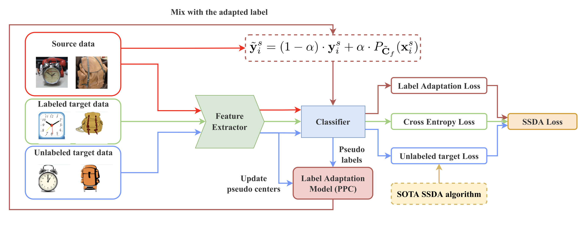

<div align="center">

# Source Label Adaptation

The official Pytorch implementation of "Semi-Supervised Domain Adaptation with Source Label Adaptation" accepted to CVPR 2023.
  
[](https://arxiv.org/abs/2302.02335)
[](https://openaccess.thecvf.com/content/CVPR2023/papers/Yu_Semi-Supervised_Domain_Adaptation_With_Source_Label_Adaptation_CVPR_2023_paper.pdf)
[](https://openaccess.thecvf.com/content/CVPR2023/supplemental/Yu_Semi-Supervised_Domain_Adaptation_CVPR_2023_supplemental.pdf)
[](#citation)

</div>


## Table of Contents
- [Introduction](#intro)
- [Demo](#demo)
- [Setting up Python Environment](#python)
- [Data Preparation](#data)
- [Setting up Wandb](#wandb)
- [Running the model](#run)
- [Citation](#citation)
- [Acknowledgement](#acknowledgement)

<a name="intro"></a>
## Introduction

In this work, we present a general framework, Source Label Adaptation (SLA) for Semi-Supervised Domain Adaptation. We introduce a novel source-adaptive paradigm that adapts the source data to match the target data. Our key idea is to view the source data as a noisily-labeled version of the ideal target data. Since the paradigm is very different from the core ideas behind existing SSDA approaches, our proposed model can be easily coupled with the current state-of-the-art SSDA methods and further improve their performance. The illustration of the framework is shown below.

Click on the image below to watch the video explaining our work.
[](https://youtu.be/oVOQI9c1hYE)


<a name="demo"></a>
## Demo

The demo below shows results of 6 different methods implemented in the code on 3-shot Office-Home A -> C case with the seed `19980802`.


After selecting the test accuracy achieved at the iteration when the best evaluation accuracy was obtained, we observed improvements of `+3.214%, +1.007%, +2.183%` for the `base, mme, cdac` methods, respectively, after applying our SLA method.

Check more demos in our [demo page](https://github.com/chu0802/SLA/tree/main/demo).

More experimental results can be found in [our main paper](https://arxiv.org/abs/2302.02335).


<a name="python"></a>
## Setting up Python Environment

Use conda to create a new environment by running the following command:

```sh
conda env create --name <env_name> --file environment.yaml
```

Replace <env_name> with the desired name of your new environment. This command will create a new environment with Python version 3.10.10 and install all the required packages specified in the environment.yaml file.

### Compatible PyTorch version

The environment file specifies PyTorch version 2.0. Emprically it has shown to speed up the training progress.

However, the code does not use any PyTorch 2.0 features and should be compatible with older versions of PyTorch, such as version 1.12.0.

<a name="data"></a>
## Data Preparation

### Supported Datasets

Currently, we support the following datasets:

- [DomainNet](http://ai.bu.edu/M3SDA/)
- [OfficeHome](https://www.hemanthdv.org/officeHomeDataset.html)

### Dataset Architecture

The dataset is organized into directories, as shown below:

```
- dataset_dir
    - dataset_name
        - domain 1
        - ...
        - domain N
        - text
            - domain 1
                - all.txt
                - train_1.txt
                - train_3.txt
                - test_1.txt
                - test_3.txt
                - val.txt
            - ...
            - domain N
    - ...
```

### Download and Preparation

Before running the data preparation script, make sure to update the configuration file in `data_preparation/dataset.yaml` with the correct settings for your dataset. In particular, you will need to update the `dataset_dir` variable to point to the directory where your dataset is stored.

```yaml
dataset_dir: /path/to/dataset
```

To download and prepare one of these datasets, run the following commands:

```sh
cd data_preparation
python data_preparation.py --dataset <DATASET>
```

Replace <DATASET> with the name of the dataset you want to prepare (e.g. DomainNet, OfficeHome). This script will download the dataset (if necessary) and extract the text data which specify the way to split training, validation, and test sets. The resulting data will be saved in the format described above.

After running the data preparation script, you should be able to use the resulting data files in this repository.

<a name="wandb"></a>
## Setting up Wandb

We use Wandb to record our experimental results. Check [here](https://wandb.ai) for more details. The code will prompt you to login to your Wandb account.

<a name="run"></a>
## Running the model

### Baseline methods

To run the main Python file, use the following command:

```sh
python main.py --method mme --dataset OfficeHome --source 0 --target 1 --seed 1102 --num_iters 10000 --shot 3shot
```

This command runs the MME model on the 3-shot A -> C Office-Home dataset, with the specified hyperparameters. You can modify the command to run different experiments with different hyperparameters or on different datasets.

The following methods are currently supported:
1. `base`: Uses **S+T** as described in our [main paper](https://arxiv.org/abs/2302.02335).
2. `mme`: Uses **mme** as described in [this paper](https://openaccess.thecvf.com/content_ICCV_2019/papers/Saito_Semi-Supervised_Domain_Adaptation_via_Minimax_Entropy_ICCV_2019_paper.pdf).
3. `cdac`: Uses **cdac** as described in [this paper](https://openaccess.thecvf.com/content/CVPR2021/papers/Li_Cross-Domain_Adaptive_Clustering_for_Semi-Supervised_Domain_Adaptation_CVPR_2021_paper.pdf).

### Applying SLA to baseline methods

To apply our proposed SLA method, append the suffix "_SLA" to the selected method. For example:

```sh
python main.py --method mme_SLA --dataset OfficeHome --source 0 --target 1 --seed 1102 --num_iters 10000 --shot 3shot --alpha 0.3 --update_interval 500 --warmup 500 --T 0.6
```

This command runs the MME + SLA model on the 3-shot A -> C Office-Home dataset, with the specified hyperparameters. Check our [main paper](https://arxiv.org/abs/2302.02335) to find the recommended hyperparameters for each method on each dataset.

<a name="citation"></a>
## Citation

If you find our work useful, please cite it using the following BibTeX entry:

```bibtex
@InProceedings{Yu_2023_CVPR,
    author    = {Yu, Yu-Chu and Lin, Hsuan-Tien},
    title     = {Semi-Supervised Domain Adaptation With Source Label Adaptation},
    booktitle = {Proceedings of the IEEE/CVF Conference on Computer Vision and Pattern Recognition (CVPR)},
    month     = {June},
    year      = {2023},
    pages     = {24100-24109}
}
```

<a name="acknowledgement"></a>
## Acknowledgement

This code is partially based on [MME](https://github.com/VisionLearningGroup/SSDA_MME), [CDAC](https://github.com/lijichang/CVPR2021-SSDA) and [DeepDA](https://github.com/jindongwang/transferlearning/tree/master/code/DeepDA).

The backup urls for OfficeHome, Office31 are provided [here](https://github.com/jindongwang/transferlearning/blob/master/data/dataset.md).
